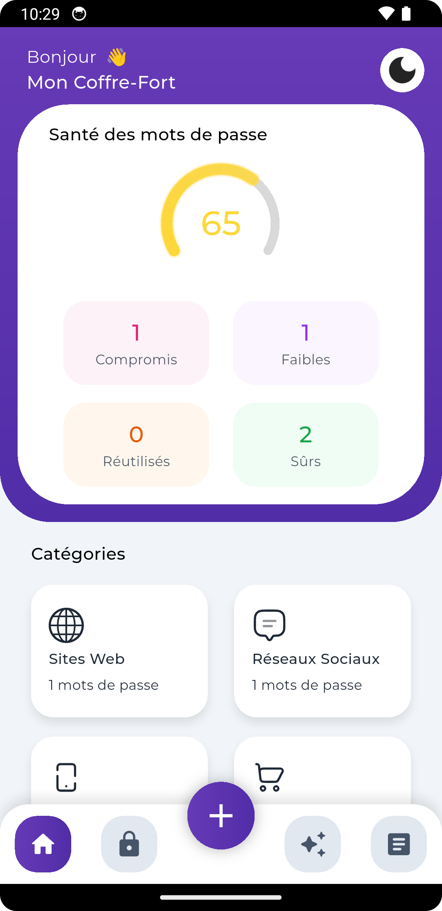
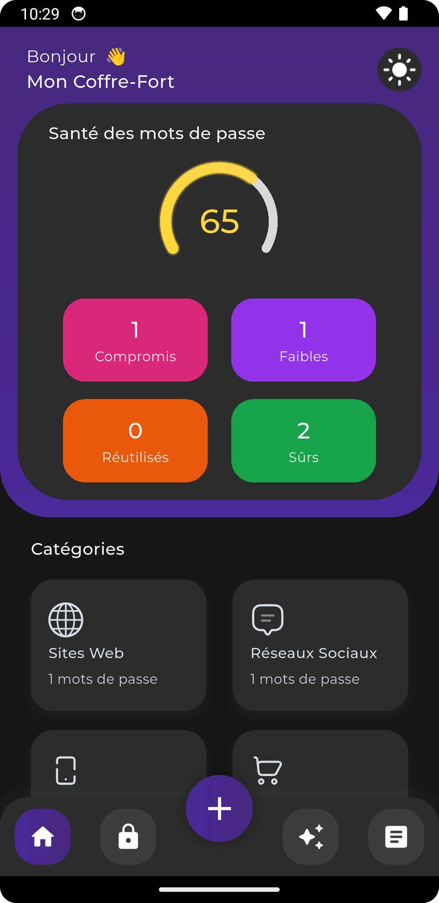
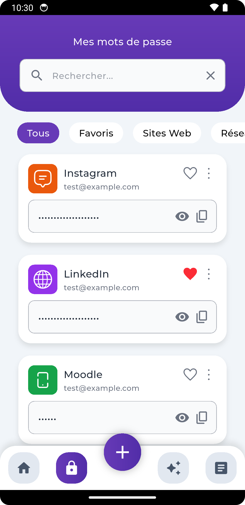
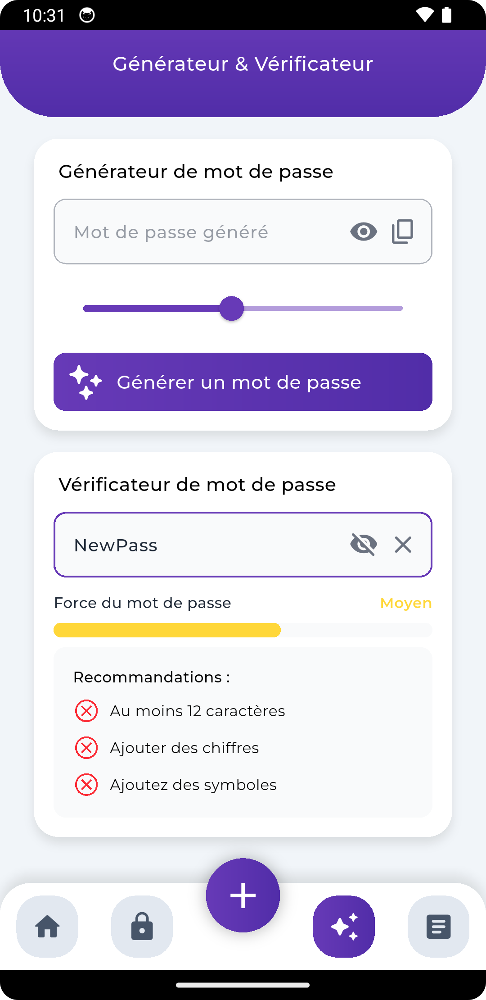
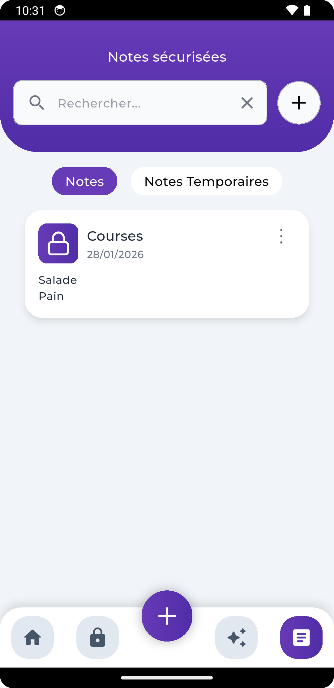

# Safe Vault

A secure password manager mobile application built with Flutter.

Made by Alexis Pagnon and Adam Sanchez as a student project for the "Compilation et Développement d'Applications Mobiles" course at INSA Hauts-de-France.

## Overview

Safe Vault is a secure mobile application for managing and protecting your passwords. Built with Flutter, it ensures your sensitive data is encrypted and easily accessible only to you.

## Features

- Secure password storage with strong encryption
- Biometric authentication
- Easy password generation
- Categorize and organize credentials
- Search and filter passwords
- Passwords health check (strength analysis, reuse detection, compromise alerts)
- Add secure notes and temporary notes 

## Screenshots
<!-- Add screenshots of your app here -->

<p align="center">
  
  
  
  
  
</p>

## Getting Started

### Prerequisites
- [Flutter SDK](https://flutter.dev/docs/get-started/install)
- Android Studio or Xcode (for iOS)
- A device or emulator

### Installation
1. Clone the repository:
	```bash
	git clone https://github.com/yourusername/safe_vault.git
	cd safe_vault
	```
2. Install dependencies:
	```bash
	flutter pub get
	```
3. Run the app:
	```bash
	flutter run
	```
4. For building release:
    ```bash
    flutter build apk --release  # For Android
    flutter build ios --release   # For iOS
    ```

## Folder Structure

- `lib/` - Main source code
  - `models/` - Data models
  - `viewmodels/` - State management
  - `views/` - UI screens
- `assets/` - Fonts, images, and SVGs

## Contact

For questions or support, please contact [alexis.pagnon@uphf.fr](mailto:alexis.pagnon@uphf.fr) or [adam.sanchez@uphf.fr](mailto:adam.sanchez@uphf.fr).
